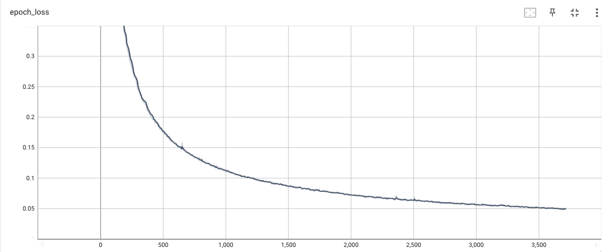

# Vietnamese Laws Chatbot with Transformer Model

Transformer Model Training with TensorFlow

## Introduction
This project revolves around training a chatbot using the powerful Transformer architecture in TensorFlow. Specifically designed to handle Vietnamese Laws-related inquiries, this chatbot leverages advanced natural language processing capabilities for accurate and contextually relevant responses.

## Features
Transformer Architecture: Utilize the state-of-the-art Transformer model for processing complex legal inquiries efficiently.
Legal Expertise: Harness the knowledge of Vietnamese Laws to provide precise and reliable information.
Interactive Conversations: Engage users in dynamic and interactive legal discussions, ensuring a seamless experience.
Customization: Tailor the chatbot's understanding of Vietnamese Laws to address specific legal domains and nuances.
Real-time Assistance: Offer real-time legal guidance to users seeking information within the realm of Vietnamese Laws.

## Download dataset
This chatbot is trained on a comprehensive Vietnamese Laws dataset, encompassing diverse legal documents to ensure a comprehensive understanding of the subject matter.
You can download the dataset from the following link:

[Download Dataset](https://drive.google.com/drive/folders/1jMmkgAQ9QeSV4eLlzmkxBtftLpmDMOel?usp=sharing)

## Installation

Provide step-by-step instructions on how to install and set up your project. Include any dependencies that need to be installed and any configuration steps. For example:

```bash
git clone https://github.com/blak-tran/vietnamese_chatbot_research.git

cd vietnamese_chatbot

pip install tensorflow[and-cuda]

pip install -r requirements.txt
```

## Pretrained Model

You can download the pretrained Transformer model for the Vietnamese Laws Chatbot from the following link:

[Download Pretrained Model](https://drive.google.com/drive/folders/1ym6IEKV8b1q7InmwzCMCDimior3ABIdj?usp=sharing)

## Pretrained Model Results

### Epoch Accuracy


### Epoch Learning Rate


### Epoch Loss


## Train

```bash
python train.py --data_file your/dataset/path \
  --vector_path wiki/vector/path \
  --epochs your/epochs \
  --save_frequency 600 \
  --log_dir ./logs/laws
```


